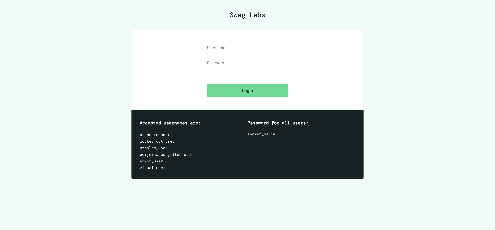
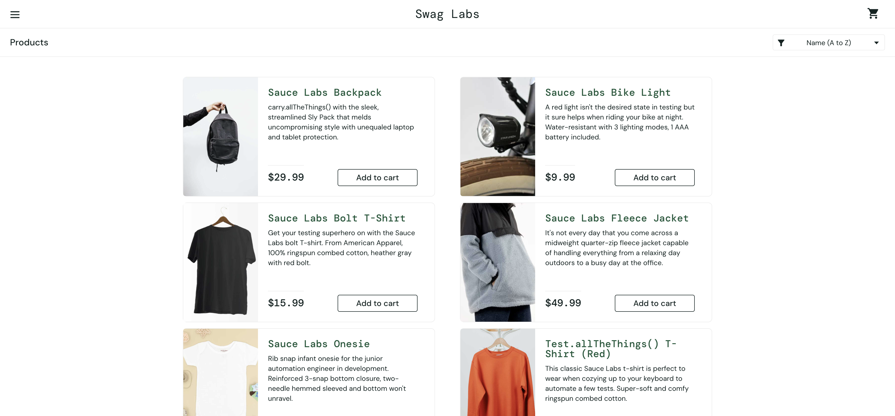
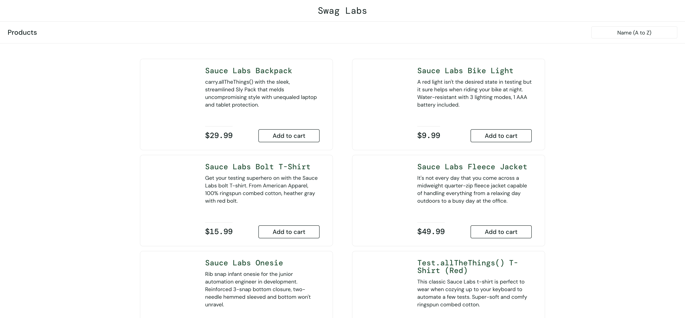
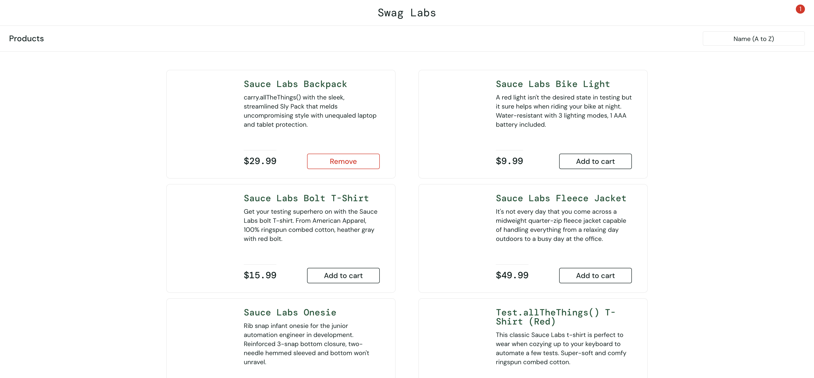
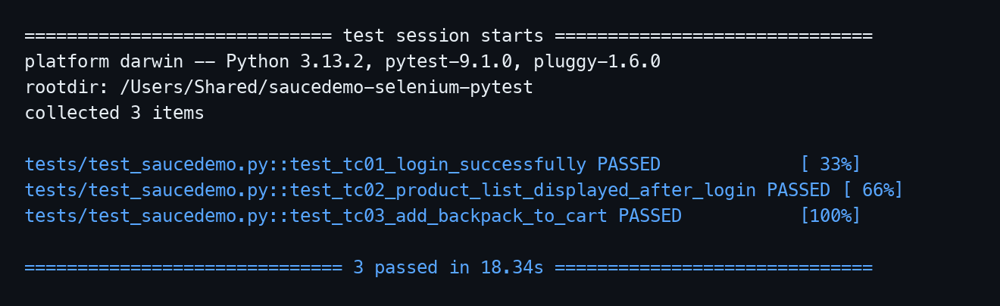

# Báo cáo thực hành kiểm thử Selenium

## 1. Thông tin bài thực hành

* Công cụ kiểm thử: Selenium WebDriver
* Ngôn ngữ lập trình: Python
* Framework kiểm thử: Pytest
* Website kiểm thử: https://www.saucedemo.com/
* Trình duyệt sử dụng: Google Chrome
* Số lượng test case: 03 test case
* Lệnh chạy test: `pytest -v`

## 2. Giới thiệu công cụ Selenium

Selenium là một công cụ kiểm thử tự động được sử dụng phổ biến trong kiểm thử ứng dụng web. Công cụ này cho phép người kiểm thử tự động hóa các thao tác trên trình duyệt như mở website, nhập dữ liệu, nhấn nút, chuyển trang và kiểm tra kết quả hiển thị.

Trong bài thực hành này, em sử dụng Selenium WebDriver kết hợp với Python, Pytest và webdriver-manager để viết mã kiểm thử tự động cho website SauceDemo. Pytest được dùng để tổ chức và chạy các test case, còn webdriver-manager giúp tự động tải và quản lý ChromeDriver.

## 3. Mục tiêu thực hành

* Tìm hiểu cách sử dụng Selenium WebDriver để kiểm thử tự động giao diện web.
* Biết cách viết test case tự động bằng Python và Pytest.
* Xây dựng tối thiểu 03 test case kiểm thử tự động cho website SauceDemo.
* Kiểm thử các chức năng cơ bản của website như đăng nhập thành công, hiển thị danh sách sản phẩm và thêm sản phẩm vào giỏ hàng.
* Lưu project thực hành lên GitHub để nộp bài.

## 4. Website được kiểm thử

Website được sử dụng để thực hành kiểm thử là:

https://www.saucedemo.com/

Đây là website demo thương mại điện tử, có các chức năng cơ bản như đăng nhập, xem danh sách sản phẩm, thêm sản phẩm vào giỏ hàng và xem giỏ hàng.

Tài khoản dùng để kiểm thử:

* Username: `standard_user`
* Password: `secret_sauce`

## 5. Công cụ và môi trường thực hiện

| Thành phần         | Nội dung                       |
| ------------------ | ------------------------------ |
| Ngôn ngữ           | Python                         |
| Công cụ kiểm thử   | Selenium WebDriver             |
| Framework test     | Pytest                         |
| Quản lý driver     | webdriver-manager              |
| Trình duyệt        | Google Chrome                  |
| Website kiểm thử   | SauceDemo                      |
| File test          | tests/test_saucedemo.py        |
| Hình thức kiểm thử | Kiểm thử tự động giao diện web |

## 6. Cấu trúc project

```text
saucedemo-selenium-pytest/
├── tests/
│   └── test_saucedemo.py
├── images/
├── requirements.txt
├── README.md
└── .gitignore
```

## 7. Cài đặt và chạy test

Cài đặt các thư viện cần thiết:

```bash
pip install -r requirements.txt
```

File `requirements.txt` gồm:

```text
selenium
pytest
webdriver-manager
```

Chạy toàn bộ test case:

```bash
pytest -v
```

## 8. Danh sách test case

| Mã test case | Tên test case                     | Dữ liệu kiểm thử                                    | Kết quả mong đợi                         |
| ------------ | --------------------------------- | --------------------------------------------------- | ---------------------------------------- |
| TC01         | Đăng nhập thành công              | Username: `standard_user`, Password: `secret_sauce` | Hệ thống chuyển đến trang Products       |
| TC02         | Kiểm tra danh sách sản phẩm       | Tài khoản hợp lệ                                    | Danh sách sản phẩm được hiển thị         |
| TC03         | Thêm sản phẩm vào giỏ hàng        | Sản phẩm: `Sauce Labs Backpack`                     | Giỏ hàng hiển thị số lượng sản phẩm là 1 |

## 9. Mô tả chi tiết test case

### 9.1. TC01 - Đăng nhập thành công

Các bước thực hiện:

1. Mở website https://www.saucedemo.com/
2. Nhập username là `standard_user`
3. Nhập password là `secret_sauce`
4. Nhấn nút Login
5. Kiểm tra URL có chứa `inventory.html`
6. Kiểm tra tiêu đề trang hiển thị là `Products`

Kết quả mong đợi: Người dùng đăng nhập thành công và được chuyển đến trang danh sách sản phẩm.

Kết quả thực tế: Test case chạy thành công.

---

### 9.2. TC02 - Kiểm tra danh sách sản phẩm

Các bước thực hiện:

1. Mở website https://www.saucedemo.com/
2. Đăng nhập bằng tài khoản hợp lệ
3. Chờ danh sách sản phẩm hiển thị
4. Kiểm tra trang có ít nhất một sản phẩm
5. Kiểm tra tên sản phẩm được hiển thị trên giao diện

Kết quả mong đợi: Danh sách sản phẩm được hiển thị sau khi đăng nhập thành công.

Kết quả thực tế: Test case chạy thành công.

---

### 9.3. TC03 - Thêm sản phẩm vào giỏ hàng

Các bước thực hiện:

1. Mở website https://www.saucedemo.com/
2. Đăng nhập bằng tài khoản hợp lệ
3. Chọn sản phẩm `Sauce Labs Backpack`
4. Nhấn nút Add to cart
5. Kiểm tra biểu tượng giỏ hàng hiển thị số lượng là `1`

Kết quả mong đợi: Sản phẩm `Sauce Labs Backpack` được thêm vào giỏ hàng thành công.

Kết quả thực tế: Test case chạy thành công.

## 10. Minh chứng thực nghiệm

### 10.1. Giao diện website SauceDemo



### 10.2. Kết quả chạy TC01 - Đăng nhập thành công



### 10.3. Kết quả chạy TC02 - Danh sách sản phẩm



### 10.4. Kết quả chạy TC03 - Thêm sản phẩm vào giỏ hàng



### 10.5. Kết quả chạy toàn bộ test case



## 11. Kết quả thực nghiệm

Sau khi chạy các test case bằng lệnh `pytest -v`, cả 03 test case đều chạy thành công.

| Mã test case | Tên test case              | Kết quả |
| ------------ | -------------------------- | ------- |
| TC01         | Đăng nhập thành công       | Passed  |
| TC02         | Kiểm tra danh sách sản phẩm| Passed  |
| TC03         | Thêm sản phẩm vào giỏ hàng | Passed  |

Kết quả tổng quan:

```text
tests/test_saucedemo.py::test_tc01_login_successfully PASSED
tests/test_saucedemo.py::test_tc02_product_list_displayed_after_login PASSED
tests/test_saucedemo.py::test_tc03_add_backpack_to_cart PASSED
```

## 12. Hướng dẫn chèn ảnh minh họa

Sau khi chạy test, chụp màn hình kết quả và lưu vào thư mục `images`.

Tên ảnh nên đặt như sau:

```text
images/01-saucedemo-home.png
images/02-tc01-login-success.png
images/03-tc02-product-list.png
images/04-tc03-add-cart.png
images/05-ket-qua-chay-test.png
```

Sau đó thêm ảnh lên GitHub:

```bash
git add images/
git commit -m "Add test result images"
git push
```

Khi ảnh đã được thêm đúng đường dẫn, GitHub sẽ hiển thị ảnh trực tiếp trong README.

## 13. Nhận xét

Qua quá trình thực hành, em đã hiểu cách sử dụng Selenium WebDriver để tự động hóa thao tác kiểm thử trên trình duyệt. Việc kết hợp Selenium với Pytest giúp test case được tổ chức rõ ràng, dễ chạy và dễ kiểm tra kết quả.

webdriver-manager hỗ trợ tự động quản lý ChromeDriver, giúp quá trình cài đặt và chạy test thuận tiện hơn. Các câu lệnh `assert` trong Pytest được dùng để xác nhận kết quả thực tế có đúng với kết quả mong đợi hay không.

## 14. Kết luận

Bài thực hành đã hoàn thành yêu cầu tìm hiểu công cụ kiểm thử Selenium và xây dựng tối thiểu 03 test case kiểm thử tự động cho một website.

Các test case đã kiểm thử được những chức năng cơ bản gồm đăng nhập thành công, kiểm tra danh sách sản phẩm và thêm sản phẩm vào giỏ hàng. Kết quả thực nghiệm cho thấy cả 03 test case đều chạy thành công, đáp ứng đúng kết quả mong đợi.
